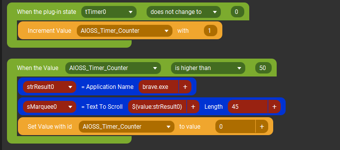
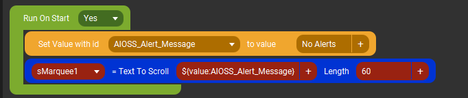

# Touch Portal zTools Plugin

- [Touch Portal zTools Plugin](#touch-portal-ztools-plugin)
  - [Changelog](#changelog)
  - [Description](#description)
  - [Install](#install)
  - [Actions](#actions)
    - [Operators](#operators)
    - [If Then Operator](#if-then-operator)
    - [If Then Else Operator](#if-then-else-operator)
    - [If And/Or Then Operator](#if-and-or-then-operator)
    - [If And/Or Then Else Operator](#if-and-or-then-else-operator)
    - [SubString](#substring)
    - [Mid](#mid)
    - [Left](#left)
    - [Right](#right)
    - [Starts With](#starts-with)
    - [Ends With](#ends-with)
    - [Length](#length)
    - [Get Window Title](#get-window-title)
    - [Scrolling Marquee](#scrolling-marquee)
    - [Screen Window Capture](#screen-capture)
  - [Events](#events)
    - [Timer](#timer)
    - [Run On Start](#run-on-start)
  - [Connectors](#connectors)
    - [Get Slider Value](#get-slider-value)
  - [States](#states)
    - [Operator States](#operator-states)
    - [String States](#string-states)
    - [Marquee States](#marquee-states)
    - [Screen States](#screen-states)
    - [Connector States](#connector-states)
  - [Issues](#issues)
  - [Author](#author)

## Changelog
```
1.2- Update
    - Added
        - Run On Start Action
        - Get Window Title Action
        - Added Unicode Support
    - Changes
        - Timer completely reworked, runs at 100ms at all times.
        - Fixed several conversion errors with string relation actions.
        - Scrolling Marquee now auto updates. Use with Dynamic Text Updater Action.
1.1 - Update
    - Changes
        - Screen/Window Capture now looks for selected window title, then same exe name if window title isn't found.
        - Fixed Importing into Touch Portal freezing mid import.
        - Fixed Else returning wrong data on the If/Else Operator Action.
1.0 - Update
    - Actions
        - Added If And/Or Then Operator
        - Added If Ando/or Then Else Operator
    - Changes
        - Created Separate Loop For Processing Events, Should be approx 25x Faster
0.9 - Update
    - Actions
        - Combined Screen Capture and Window Capture Into 1 Action now.
        - Fixed Static linking of included libraries, no more required DLL errors.
0.8 - The initial release
    - Actions
        - Operators - Get a Boolean result comparing 2 values. ( Operators are == , != , >= , <= , > , < , * , / , + , - )
        - If Then Operator - Compare 2 Values/States and store a value upon sucess.
        - If Then Else Operator - Compare 2 Values/States and store a value upon success/fail.
        - SubString - Obtain a portion of the string defining the Start and End point.
        - Mid - Obtain a portion of the string defining the Start poing and number of characters.
        - Left - Returns the first count characters of the string.
        - Right - Returns the last count characters of the string.
        - Starts With - Returns Boolean result if first value starts with second value.
        - Ends With - Returns Boolean result if first value ends with second value.
        - Length - Returns the length of the value.
        - Scrolling Marquee - Returns a portion of the string provided with length set.
        - Screen Capture - Will return a 128x128 Image capture of the screen at designated coordinates.
        - Window Capture - Will return a 128x128 Image capture of the application at designated coordinates.
    - Events
        - Timer - Repeat Actions at set intervals.
    - Connectors
        - Get Slider Value - Obtain the value of a slider and store it.
    - States
        - opResults - States used to store Operation results.
        - strResults - States used to store String results.
        - sMarquee - Stated used to store Marquee results.
        - sCapture - States used to store Screen/Window Capture images.
        - conResult - States used to store Slider values.

```

## Description
These are basic programming functions plus some extra tools added to make customizing touch portal easier. 

- Warning: It is advised when using any of the returned results ( States ) from any Actions from this plugin, in succession, to use a "Wait for Timer" Action to allow the plugin to process the result and return it. Touch Portal and this plugin run separately and failing to allow time for the value to be returned may produce undesired results.

This is still being worked on and there may be bugs or unpredictable results.

## Install

1. Import the .tpp file into Touch Portal
2. Click Okay and Trust Always

## Actions

### Operators

Get a Boolean result comparing 2 values. ( 0 for False, 1 for True )
 - Note: If comparing 2 sets of Text, it will check if they're the same, if only one is Text it will compare the length.


### If-Then Operator

Compare 2 Values/States and store a value upon sucess.
 - Note: If comparing 2 sets of Text, it will check if they're the same, if only one is Text it will compare the length.


### If-Then-Else Operator

Compare 2 Values/States and store a value upon success/fail.
- Note: If comparing 2 sets of Text, it will check if they're the same, if only one is Text it will compare the length.


### If-And-Or-Then Operator

Compare 2 Values/States with 2 other Values/States and store a value upon sucess.
 - Note: If comparing 2 sets of Text, it will check if they're the same, if only one is Text it will compare the length.


### If-And-Or-Then-Else Operator

Compare 2 Values/States with 2 other Values/States and store a value upon sucess/fail.
 - Note: If comparing 2 sets of Text, it will check if they're the same, if only one is Text it will compare the length.


### SubString

Obtain a portion of the string defining the Start and End point.


### Mid

Obtain a portion of the string defining the Start poing and number of characters.


### Left

Returns the first count characters of the string.


### Right

Returns the last count characters of the string.


### Starts With

Returns Boolean result if first value starts with second value. ( 0 for False, 1 for True )


### Ends With

Returns Boolean result if first value ends with second value. ( 0 for False, 1 for True )


### Length

Returns the length of the value.


### Scrolling Marquee

Returns a portion of the string provided with length set. Execute once, auto updates to sMarquee values. Use with Dynamic Text Updater Event.


Example usage.


### Screen-Window Capture

Will return a 128x128 Image capture of the screen at designated coordinates.
  - Note: Border Option will make the selected sides transparent by the amount of pixels selected, useful for displaying a border around the image.


## Events

### Timer

Repeat Actions at 100ms intervals.


Increase length of timer example ( runs every 5 seconds ).



### Run On Start

Execute Actions Upon Plugin/Touch Portal Starting



## Connectors

### Get Slider Value

Obtain the value of a slider and store it.


## States

This plugin gives you 10 states of each.
  - opResults - States used to store Operation results.
  - strResults - States used to store String results.
  - sMarquee - Stated used to store Marquee results.
  - sCapture - States used to store Screen/Window Capture images. ( 20 states )
  - conResult - States used to store Slider values.

## Issues
Please report issues on the #zTools channel on the Official Touch Portal Discord.

## Author
James Burns (aka ZKAT8IT)
